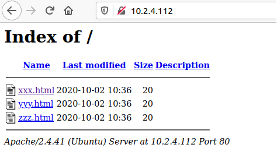
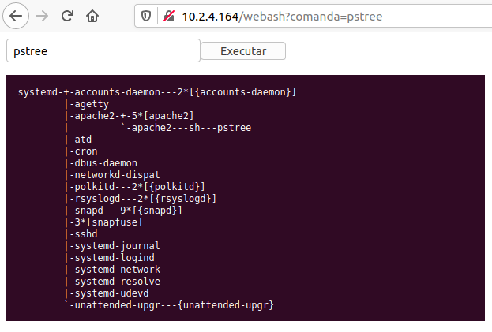
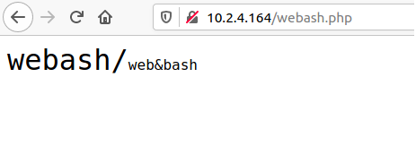
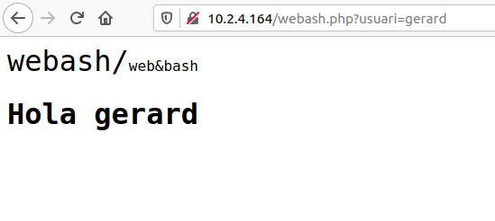
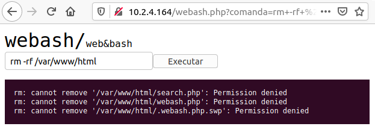

# UF1 - Ofimàtica i eines web

## Introducció
Una aplicació web és una aplicació a la qual accedim mitjançant protocol HTTP utilitzant un navegador web. Hem vist el protocol HTTP, però no com utilitzar-lo per implementar una aplicació.

### Aplicacions en el costat del servidor

A la banda de servidor, hem d'aconseguir que el nostre servidor HTTP sigui capaç d'executar programes d'aplicació que recullin els paràmetres de peticions de client, els processin i tornin a el servidor un document que aquest passarà al seu torn a client.

Així, per al client el servidor no haurà fet res diferent al que estipula el protocol HTTP, però el servidor es pot valer d'eines externes per processar i servir la petició sol·licitada, podent així no limitar-se a servir pàgines estàtiques, sinó utilitzar altres aplicacions (servlets, JSP, PHP, etc.) per servir documents amb contingut dinàmic.

Els programes d'aplicació són típicament programes que realitzen consultes a bases de dades, processen la informació resultant i tornen la sortida a servidor, entre altres tasques.

### Aplicacions en el costat del client

Es tenen moltes tecnologies relacionades amb extensions de la banda de el client (entenent client com un navegador que interpreta codi HTML). El codi HTML és un codi estàtic que només permet formatar l'aparença d'una pàgina i definir enllaços a altres pàgines o URL. Això no és suficient si volem que el navegador realitzi funcions més complicades: validar entrades de formularis, mostrar l'evolució de l'preu d'unes accions, etc.

Per ampliar les funcionalitats de el navegador (respectant el protocol HTTP), s'utilitzen tecnologies com JavaScript, Applets etc. Aquestes es basen en fer que el navegador executi codi que li passa al servidor, bé embegut en documents HTML (com és el cas de JavaScript), o bé mitjançant fitxers compilats multiplataforma (com és el cas dels Applets Java).


## HTML i CSS

Originalment, les pàgines HTML només incloïen informació sobre els seus continguts de text i imatges. Amb el desenvolupament de l'estàndard HTML, van començar a incloure també informació sobre l'aspecte dels seus continguts: tipus de lletra, colors i marges.

La posterior aparició de tecnologies com JavaScript, van provocar que les pàgines HTML també incloguessin el codi de les aplicacions (scripts) que s'utilitzen per crear pàgines web dinàmiques.
Incloure en una mateixa pàgina HTML els continguts, el disseny i la programació complica en excés el seu manteniment. Normalment, els continguts i el disseny de la pàgina web són responsabilitat de diferents persones, pel que és adequat separar-los. CSS és el mecanisme que permet separar els continguts definits mitjançant XHTML i l'aspecte que han de presentar aquests continguts:


Un altre avantatge de la separació dels continguts i la seva presentació és que els documents XHTML creats són més flexibles, ja que s'adapten millor a les diferents plataformes: pantalles d'ordinador, pantalles de dispositius mòbils, impressores i dispositius utilitzats per persones discapacitades.

D'aquesta manera, utilitzant exclusivament XHTML es creen pàgines web "lletges" però correctes. Aplicant CSS, es poden crear pàgines "boniques" a partir de les pàgines XHTML correctes.

## World Wide Web

El científic anglés Tim Berners-Lee va inventar la World Wide Web (WWW), Xarxa d'Abast Mundial, en 1989, mentre treballava al CERN.

Coneguda comunament com la Web, és un sistema d'informació on documents i altres recursos són identificats amb URLs (Uniform Resource Locators), com, per exemple, http://wikipedia.org, que poden ser enllaçats amb hypertext, i són accessibles a través d'Internet.

Els recrsos de la Web són transferits pels Servidors Web via l' Hypertext Transfer Protocol (HTTP) i es pot accedir a ells utilitzant el Navegador Web.

## URL

Com hem dit, les URLs són identificadors de recursos. Els recursos poden ser molt diversos: pàgines, imatges, videos, fitxers, etcètera. Per exemple:

* La url http://info.cern.ch/ identifica la pàgina principal del CERN
* La url https://upload.wikimedia.org/wikipedia/commons/f/f8/Tim_Berners-Lee.jpg identifica una imatge (de Tim, és clar)
* La url https://upload.wikimedia.org/wikipedia/commons/a/a3/Tim_Berners_Lee_changed_the_world_25_years_ago_-_Tim_Berners_Lee.webm identifica un vídeo.

Una URL es compon de 7 components:

1. **Scheme:** defineix el protocol d'accés al document (http, https, ftp, mailto, file, data)
2. **User:** la identifiació de l'usuari que accedeix al recurs
3. **Host:** l'adreça IP o el nom DNS del servidor
4. **Port:** El port del servidor al qual es connecta
5. **Path:** Identifica el recurs al qual es vol accedir
6. **Query:** Dades addicionals sobre el recurs
7. **Fragment:** Localització a dintre del propi recurs

Anem a veure amb més detall aquests components.


## Scheme

El protocol d'accés al recurs indica la forma concreta en que s'han de comunicar el que fa la petició i el que la respon.

Per exemple, el protocol `http` serveix per a comunicar amb un servidor web. La especificacio del protocol és molt extensa, però podem veure un exemple senzill.

En la seva forma més utilitzada, HTTP serveix per a obtenir recursos.

Suposem que volem obtenir la pàgina principal del CERN. Aleshores, hem de realitzar un petició HTTP al seu servidor (info.cern.ch). Les dades que enviarem al servidor han de seguir exactament el protocol.

Utilitzarem el programa nc per a comunicar amb el servidor del CERN.

Obre un terminal i executa la següent comanda:

```console
user@school:~$ nc info.cern.ch 80
```

Amb aquesta comanda hem connectat al `port 80` del servidor del CERN. Ara el servidor està esperant que li enviem dades.

Si enviem qualsevol dada al servidor, aquest no serà capaç de comprendre la petició. Li hem de enviar les dades adequades, seguint el protocol HTTP.

Prova a escriure alguna cosa, i polsa `Intro` per a enviar les dades al servidor.

El servidor respondrà amb un error `400 (Bad request)`. La petició no ha estat correcta.

```console
user@school:~$ nc info.cern.ch 80
jlaksdfklaksdf
HTTP/1.1 400 Bad Request
Date: Wed, 15 Sep 2021 08:07:08 GMT
Server: Apache
Content-Length: 226
Connection: close
Content-Type: text/html; charset=iso-8859-1

<!DOCTYPE HTML PUBLIC "-//IETF//DTD HTML 2.0//EN">
<html><head>
<title>400 Bad Request</title>
</head><body>
<h1>Bad Request</h1>
<p>Your browser sent a request that this server could not understand.<br />
</p>
</body></html>
```

Per a fer la petició correcta hem fer el següent:

1. Connectem amb el servidor:
```console
    nc info.cern.ch 80
```
2. Escrivim la comanda GET
  - després el recurs que volem /index.html
  - després la versió del protocol HTTP/1.0
  - després un "retorn de carro" `Ctrl + V` `Ctrl + M`
  - i per últim un "retorn de línia" Intro

```console
GET /index.html HTTP/1.0
```


3. Especifiquem el Host al qual estem connectant
  - introduint Host: info.cern.ch
  - "retorn de carro" `Ctrl + V` `Ctrl + M`
  - i "retorn de línia" `Intro`

```console
  Host: info.cern.ch
```
  `Ctrl + V` `Ctrl + M` `Intro`

4. Indiquem al servidor que ha finalitzat la petició amb:
  - "retorn de carro" `Ctrl + V` `Ctrl + M`
  - i "retorn de línia" `Intro`

Aquest cop sí, el servidor ens respon amb `200 (OK)`, i ens retorna el recurs solicitat.

```console
user@school:~$ nc info.cern.ch 80
GET /index.html HTTP/1.0^M
Host: info.cern.ch^M
^M
HTTP/1.1 200 OK
Date: Wed, 15 Sep 2021 08:20:44 GMT
Server: Apache
Last-Modified: Wed, 05 Feb 2014 16:00:31 GMT
ETag: "286-4f1aadb3105c0"
Accept-Ranges: bytes
Content-Length: 646
Connection: close
Content-Type: text/html

<html><head></head><body><header>
<title>http://info.cern.ch</title>
</header>

<h1>http://info.cern.ch - home of the first website</h1>
<p>From here you can:</p>
<ul>
<li><a href="http://info.cern.ch/hypertext/WWW/TheProject.html">Browse the first website</a></li>
<li><a href="http://line-mode.cern.ch/www/hypertext/WWW/TheProject.html">Browse the first website using the line-mode browser simulator</a></li>
<li><a href="http://home.web.cern.ch/topics/birth-web">Learn about the birth of the web</a></li>
<li><a href="http://home.web.cern.ch/about">Learn about CERN, the physics laboratory where the web was born</a></li>
</ul>
</body></html>
```

Aquesta petició que hem realitzat a mà és exactament el que fa el navegador web quan introduim la URL http://info.cern.ch a la barra d'adreçes.

Pots comprovar-ho de la següent forma:

1. Obre una pestanya nova del Firefox

2. Polsa F12 per a obrir les Eines de desenvolupador

3. Ves a la pestanya

4. Introdueix http://info.cern.ch/index.html a la barra d'adreçes i navega a la pàgina

5. Firefox et mostrarà tots els recursos que està descarregant del servidor

6. Selecciona el recurs index.html

7. A la pestanya lateral , baixa fins a i activa l'opció

Allà pots veure tota la petició HTTP que s'ha realitzat:


Ho farem ara al servidor que tenim instal·lat al nostre contenidor.

## User

Alguns servidors requereixen d'autenticació amb usuari:contrasenya per a accedir a certs recursos

Configurarem el nostre servidor per a requerir usuari:contrasenya en l'accés.

Obrim el fitxer de configuració del servidor Apache:

```console
user@school:~$ nano /etc/apache2/sites-enabled/000-default
```

Afegim les següents línies per a activar l'accés amb usuari/password:

```console
<VirtualHost *:80>
    ServerAdmin webmaster@localhost
    DocumentRoot /var/www/html

    ErrorLog ${APACHE_LOG_DIR}/error.log
    CustomLog ${APACHE_LOG_DIR}/access.log combined

    <Directory /var/www/html>
        AllowOverride all
    </Directory>
</VirtualHost>
```

Creem l'usuari joan:

```console
user@school:~$ htpasswd -c /var/www/contrasenyes joan
```
Comprovem que s'ha creat l'usuari:

```console
user@school:~$ cat /var/www/contrasenyes
```

Restringirem l'accés a la carepta /var/www/html a només aquells usuaris que estiguin en l'arxiu /var/www/contrasenyes. Per fer-ho hem de crear un fitxer anomenat .htaccess dintre de la carpeta que volem registringir:

```console
user@school:~$ nano /var/www/html/.htaccess
```

El contingut de l'arxiu .htaccess ha de ser aquest:

```console
AuthType Basic
AuthName "Introdueix el teu usuari i contrasenya"
AuthBasicProvider file
AuthUserFile "/var/www/contrasenyes"
Require valid-user
```

Per últim reiniciem el servidor Apache:

```console
user@school:~$ /etc/init.d/apache2 restart
```

## Host

El host és l'adreça IP o nom DNS del servidor.

Configurarem el servidor web per a que mostri dues pàgines diferents en funció del Host que se li indiqui en la petició:

Crearem dues carpetes (```aaa.com``` i ```bbb.com```), i en cadascuna d'elles posarem una web diferent.

```console
user@school:~$ mkdir /var/www/html/aaa.com
user@school:~$ mkdir /var/www/html/bbb.com
user@school:~$ echo "<h1>welcome to aaa.com</h1>" > /var/www/html/aaa.com/index.html
user@school:~$ echo "<h1>welcome to bbb.com</h1>" > /var/www/html/bbb.com/index.html
```

Canviem la configuració d'Apache per a que busqui els recursos que se li sol·licitin en una carpeta o l'altra en funció del Host (ServerName) que s'indiqui a la petició http:

```console
user@school:~$ /etc/apache2/sites-enabled/000-default

<VirtualHost *:80>
    ServerName aaa.com
    DocumentRoot /var/www/html/aaa.com
</VirtualHost>

<VirtualHost *:80>
    ServerName bbb.com
    DocumentRoot /var/www/html/bbb.com
</VirtualHost>
```
Realitzem dues peticions als diferents noms de `host`:

```console
user@school:~$ printf 'GET /index.html HTTP/1.0\r\nHost aaa.com\r\n\r\n' | nc {IP_CONTENIDOR} 80
user@school:~$ printf 'GET /index.html HTTP/1.0\r\nHost bbb.com\r\n\r\n' | nc {IP_CONTENIDOR} 80
```

Observa que segons el `Host` indicat a la petició, es retorna una web o l'altra.

## Port

Configurem Apache per a permetre conexions al port 8080:

```console
user@school:~$ nano /etc/apache2/ports.conf
```

```console
Listen 80
Listen 8080

# resta de lines
# ...
```

Servim dues pàgines diferents en funcio del port de conexió:

```console
user@school:~$ nano /etc/apache2/sites-enabled/000-default
```

```console
<VirtualHost *:80>
    DocumentRoot /var/www/html/aaa.com
</VirtualHost>

<VirtualHost *:8080>
    DocumentRoot /var/www/html/bbb.com
</VirtualHost>
```

Accedim a `http://ip_contenidor:80`

Accedim a `http://ip_contenidor:8080`

## Path

Si no s'especifica cap arxiu en el path, per defecte, el servidor apache servirà l'arixu index.html, i si aquest arxiu no existeix, servirà una pàgina que llistarà els arxius del directori:

Anem a crear diversos arxius al directory `/var/www/html`:

```console
user@school:~$ echo "<h1>Home page</h1>" > /var/www/html/index.html
user@school:~$ echo "<h1>Pagina xxx </h1>" > /var/www/html/xxx.html
user@school:~$ echo "<h1>Pagina yyy </h1>" > /var/www/html/yyy.html
user@school:~$ echo "<h1>Pagina zzz </h1>" > /var/www/html/zzz.html
```

Comprovem que tenim aquests arxius a `/var/www/html`:

```console
user@school:~$ ls /var/www/html
index.html   xxx.html   yyy.html   zzz.html
```

Si ara fem una petició al servidor sense indicar cap arxiu `http://10.2.4.1` el servidor ens enviarà l'arxiu index.html

Si especifiquem algun arxiu a la petició (e.g. `http://10.2.4.1/xxx.html`) Apache ens servirà aquest arxiu.

Si l'arxiu que posem a la url (e.g. `http://10.2.4.1/opq.html`) no existeix, apache ens servirà una pàgina **"Not Found"**

Per últim, esborrem l'arxiu index.html:

```console
user@school:~$ rm /var/www/html/index.html
```

... i comprovem que Apache ens mostra un pàgina amb la llista d'arxius del directori, quan no especifiquem cap arxiu a la url `http://10.2.4.1/` i no hi ha un `index.html`:



Al path de la url també es poden especificar els directoris on es troba l'arxiu que se solicita. Apache buscarà aquest arxius a partir del DocumentRoot.

Per exemple, si el `DocumentRoot` és `/var/www/html`, i fem aquesta petició: `http://10.2.4.1/aaa/bbb/mmm.html`, Apache buscarà aquest arxiu `/var/www/html/aaa/bbb/mmm.html`. Comprovem-ho:

```console
user@school:~$ mkdir -p /var/www/html/aaa/bbb/
user@school:~$ echo "<h1>Pagina mmm </h1>" > /var/www/html/aaa/bbb/mmm.html
```

Comprova que s'accedeix al recurs `mmm.html` amb aquesta URL `http://10.2.4.1/aaa/bbb/mmm.html`.

Ara anem a canviar el `DocumentRoot`, i farem que sigui `/var/www/html/aaa/`:

```console
user@school:~$ nano /etc/apache2/sites-enabled/000-default
```
```
<VirtualHost *:80>
    DocumentRoot /var/www/html/aaa
</VirtualHost>
```

Reiniciem el servidor:

```console
user@school:~$ /etc/init.d/apache2 restart
```

Ara, per a accedir al recurs `mmm.html`, la URL que cal posar és `http://10.2.4.1/bbb/mmm.html`.

## Query

La query serveix per a passar dades extra al recurs que s'està solicitant.

Veiem un exmple:

En aquesta url https://www.google.com/search?q=animals, estem passant al recurs search la dada extra `q=animals`. Aquest recurs ja sabrà que fer amb aquesta dada extra. Si li passem una query que el recurs no sap processar, normalment la ignorarà: https://www.google.com/search?jajaja=jejeje.

Anem a fer al nostre contenidor un recurs que accepti una query amb dades extra i faci alguna cosa amb aquestes dades.

Abans anem a ressetejar la configuració d'Apache, ja que abans l'hem deixat una mica trastocada. Tornarem a posar el DocumentRoot al seu lloc habitual.

```console
user@school:~$ printf "<VirtualHost *:80>\n\tDocumentRoot /var/www/html\n</VirtualHost>" > /etc/apache2/sites-enabled/000-default.conf
user@school:~$ /etc/init.d/apache2 restart
```

Primer hem de comprendre que el recurs no pot ser una pàgina `HTML`, ja que el llenguatge HTML només és per a definir el contingut de la pàgina. És a dir, amb HTML no podem accedir a les dades de la `query`.

Un llenguatge que sí pot obtenir les dades de la query i fer alguna cosa amb aquestes dades es `PHP`. Anem a veure uns exemples simples amb el que es pot fer amb PHP.

Primer l'instal·lem:

```console
user@school:~$ apt install -y php
```

Crearem un senzill script php que ens permetrà executar comandes al servidor a través del navegador web.



Anomenarem aquest recurs WEBASH (web + bash):

```console
user@school:~$ nano /var/www/html/webash.php
```

Afegim el següent codi a l'arxiu webash.php:

```console
<?php
echo "<style> body { font-family: Consolas, monospace; }</style>";
echo "<span style='font-size: 2em;'>webash/</span>";
echo "<span>web&bash</span>";
?>
```

Si accedim al recurs http://10.2.4.164/webash.php veurem la pàgina generada per l'script `webash.php`:



Fixa't que el que fa l'script `php` és generar codi HTML amb els `echo`. Apache executa l'script i retorna al navegador tot el que ha mostrar l'script amb els `echo`.

Per a generar codi html posarem `echo`, el codi html entre cometes `""`  i punt-i-coma `;`:

```console
echo "codi html";
```

Tot el codi PHP que escrivim ha d'anar dintre de les etiquetes
`<?php` i `?>`:

```console
<?php

// codi PHP

?>
```

De moment, el nostre codi `PHP` sempre mostra el mateix contingut, independentment de la `query` que li passem. És a dir, posis les dades que posis a la query, l'script les ignorarà. Per exemple: `http://10.2.4.164/webash.php?comanda=pstree`, o `http://10.2.4.164/webash.php?hola=quetal`.

Anem a modificar l'script per que agafi una dada de la `query` i faci alguna cosa:

Afegim aquestes línies de codi a l'arxiu `webash.php`:

```console
user@school:~$ nano /var/www/html/webash.php
```

```console
<?php
echo "<style> body { font-family: Consolas, monospace; }</style>";
echo "<span style='font-size: 2em;'>webash/</span>";
echo "<span>web&bash</span>";

echo "<h1>Hola ";
echo $_GET['usuari'];
echo "</h1>";
?>
```

Ara posem la query usuari=gerard a la url: `http://10.2.4.164/webash.php?usuari=gerard`. L'script php genera aquesta web:



Amb el codi `$_GET['usuari']` de la línia 7, hem obtingut el valor de la dada `usuari` de la query, i l'hem utilitzat per a generar el contingut de l'etiqueta `<h1>`.

Si fas la query amb un altre valor per a la dada `usuari`, l'script generarà un altre codi html que inclourà aquest valor.

Per contra, si canvies la paraula `usuari` per una altra cosa, l'script ignorarà la dada.

Quan introduïm alguna cosa en el camp de text, per exemple `hola` i li donem al botó `Executar`

Avançarem amb el webash, i ara farem que se li passi una dada anomenada `comanda`. L'script agafarà el valor d'aquesta dada i l'executarà al sistema operatiu.

```console
user@school:~$ nano /var/www/html/webash.php
```

```console
<?php
echo "<style> body { font-family: Consolas, monospace; }</style>";
echo "<span style='font-size: 2em;'>webash/</span>";
echo "<span>web&bash</span>";

system($_GET['comanda']);
?>
```

Ara l'script agafarà el valor de la dada anomenada `comanda` i l'executarà. Per exemple podem executar la `pstree` així: `http://10.2.4.164/webash.php?comanda=pstree`:


La funció `system` executa el que se li posi entre els parèntesi, i el resultat de la comanda, s'inclou a la pàgina generada.

El que està executant aleshores la funció `system` és el valor de la dada `comanda` de la query. Prova a posar aquesta url `http://10.2.4.164/webash.php?comanda=cal` o qualsevol altra comanda a la query.

Seguirem ara donant un mica d'estil a les dades generades per `system`, ja que queden totes seguides i sense format. Posarem tot el que genera el `system` dintre d'un element `<pre>`. Li posarem també una mica d'estil CSS al `<pre>`.

```console
user@school:~$ nano /var/www/html/webash.php
```

```console
<?php
echo "<style> body { font-family: Consolas, monospace; }</style>";
echo "<span style='font-size: 2em;'>webash/</span>";
echo "<span>web&bash</span>";

echo "<pre style='width: 80ch; padding: 2ch; overflow: auto; color: white; background: #300A24;'>";
system($_GET['comanda']);
echo "</pre>";
?>
```

Provem a veure com queda `http://10.2.4.164/webash.php?comanda=df -h`


Per últim, afegirem a webash una forma més còmoda de realitzar comandes, que no sigui posant-les a la url. Afegirem un formulari amb un camp de text i un botó:

```console
user@school:~$ nano /var/www/html/webash.php
```

```console
<?php
echo "<style> body { font-family: Consolas, monospace; }</style>";
echo "<span style='font-size: 2em;'>webash/</span>";
echo "<span>web&bash</span>";

echo "<form>";
echo "<input name='comanda'>";
echo "<input type='submit' value='Executar'>";
echo "</form>";

echo "<pre style='width: 80ch; padding: 2ch; overflow: auto; color: white; background: #300A24;'>";
system($_GET['comanda']);
echo "</pre>";
?>
```

Ara ens serà més còmode executar una comanda:


Quan es premi el botó Executar, automàticament el navegador web agafarà els camps del `<form>` i els afegirà a la query de la petició. Anomenarà les dades de la query segons l'atribut `name` dels `<input>` i el valor serà el que s'hagi escrit en ells. Prova a executar algunes comandes!

Acabarem fent un algunes de consideracions.

La primera és que si tractes de fer una comanda invàlida, no veuràs cap error, ja que la funció `system`, només mostra les dades de la sortida estàndard (STDOUT). Si volem veure també les dades que es mostren a la sortida d'errors (STDERR), podem redirigir-ho amb `exec 2>&1`. Canvia la línia indicada:


```console
user@school:~$ nano /var/www/html/webash.php
```

```console
<?php
echo "<style> body { font-family: Consolas, monospace; }</style>";
echo "<span style='font-size: 2em;'>webash/</span>";
echo "<span>web&bash</span>";

echo "<form>";
echo "<input name='comanda'>";
echo "<input type='submit' value='Executar'>";
echo "</form>";

echo "<pre style='width: 80ch; padding: 2ch; overflow: auto; color: white; background: #300A24;'>";
system("exec 2>&1 && " . $_GET['comanda']);
echo "</pre>";
?>
```

Ara prova a executar qualsevol comanda que generi errors i sí es mostraran:


La segona consideració és que les comandes s'executen amb els permisos de l'usuari `www-data`, i això significa que només podran fer allò que l'usuari `www-data` tingui permès fer. Per exemple:



L'ultima consideració és que el directori de treball és on es troba l'arxiu `webash.php`, així que totes les rutes que hi hagi a les comandes són relatives a aquest directori:


## Fragment

El `fragment` serveix per a fer que el navegador posicioni la pàgina en una secció determinada. Aquesta part de la url no arriba al servidor, és el navegador el qui ha de saber com gestionar el `fragment`.

Veiem un exmple:

Generem un arxiu html extens amb 5 seccions `(id=sX)` i 30 paràrafs en cada secció:

```console
user@school:~$ for i in {1..5}; do printf "<h1 id='s$i'>Seccio $i</h1>; for j in {1..30}; do printf "<p>seccio $i, paràgraf $j</p>"; done; done > /var/www/html/llarg.html
```
Prova a navegar directament a alguna de les seccions del document.

Per a definir una secció en un document hem d'afegir l'atribut `id` a l'element que desitjem. Per a navegar directament a una secció, només cal afegir un `#` seguit del valor del seu atribut `id`.
